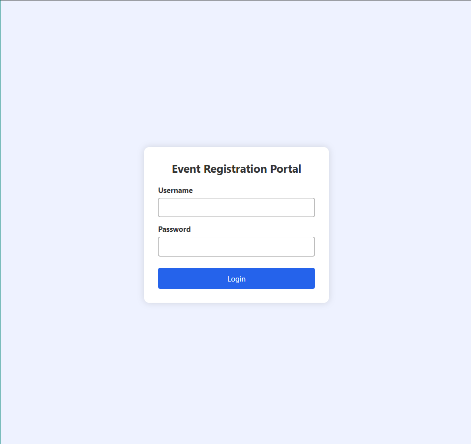
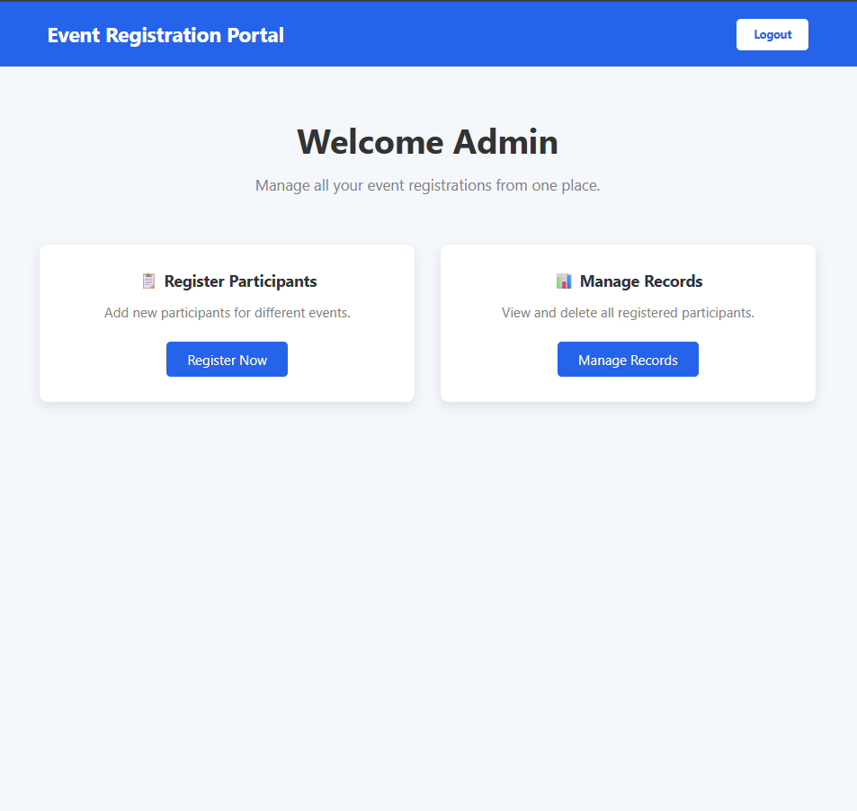

# 🎉 Event Registration Portal

A modern **Event Registration Portal** built using **Angular 20 Standalone Components**. This application allows users to log in, register participants for various events, and manage participant records using **Local Storage**. The project demonstrates Angular Routing, Reactive Forms, Services, Component-based Architecture, and CRUD operations.

---

# 📌 Project Overview

The Event Registration Portal is a web application developed using **Angular 20**.

The application allows users to:

- 🔐 Login into the application
- 📝 Register participants for different events
- 📋 View registered participants
- 🗑 Delete participant records
- 💾 Store participant data using Local Storage

The project is built using Angular's latest **Standalone Component Architecture** without using NgModules.

---

# 🚀 Features

## 🔐 Login Module

- Reactive Login Form
- Username Validation
- Password Validation
- Redirect to Dashboard
- Logout Functionality

---

## 🏠 Dashboard

- Welcome Screen
- Register Participant Card
- Manage Records Card
- Logout Button

---

## 📝 Event Registration

- Reactive Form
- Participant Name
- Email Address
- Event Selection
- Mobile Number
- Form Validation
- Success Alert
- Store Data in Local Storage

---

## 📋 Manage Records

- View Registered Participants
- Delete Participants
- Auto Refresh Table
- Navigate Back to Dashboard
- Register New Participant

---

# 🛠 Technologies Used

- Angular 20
- TypeScript
- HTML5
- CSS3
- Reactive Forms
- Angular Routing
- Angular Services
- Local Storage
- Standalone Components

---

# 📂 Project Structure

```text
src
│
├── app
│
├── components
│   ├── login
│   ├── dashboard
│   ├── event-registration
│   └── manage-records
│
├── models
│   └── participant.ts
│
├── services
│   └── event.ts
│
├── Images
│   ├── Login.png
│   ├── Dashboard.png
│   └── Managerocord.png
│
├── app.routes.ts
├── app.config.ts
├── app.ts
└── app.html
```

---

# ⚙ Functionalities

## Login

- Username Validation
- Password Validation
- Redirect to Dashboard

---

## Dashboard

Dashboard provides navigation to:

- Register Participant
- Manage Records

---

## Event Registration

Users can register participants using:

- Participant Name
- Email Address
- Event Name
- Mobile Number

Validation includes:

- Required Fields
- Email Validation
- 10-Digit Mobile Number

---

## Manage Records

Displays all registered participants stored inside Local Storage.

User can:

- View Records
- Delete Records

---

# 💾 Local Storage

Participant data is stored inside browser Local Storage.

Example

```json
[
  {
    "id": 123456,
    "participantName": "Abc",
    "email": "abc@gmail.com",
    "eventName": "Angular Workshop",
    "mobileNumber": "9876543210"
  }
]
```

---

# 🧩 Angular Concepts Used

- Angular Standalone Components
- Angular Routing
- Reactive Forms
- FormBuilder
- Validators
- Angular Services
- Dependency Injection
- TypeScript Interfaces
- Local Storage
- Property Binding
- Event Binding
- Structural Directives
- Interpolation

---

# 📋 CRUD Operations

| Operation | Status |
|-----------|--------|
| Create | ✅ |
| Read | ✅ |
| Update | ❌ |
| Delete | ✅ |

---

# ▶ How to Run

## Clone Repository

```bash
git clone <repository-url>
```

## Install Dependencies

```bash
npm install
```

## Run Project

```bash
ng serve
```

## Open Browser

```
http://localhost:4200
```

---

# 📸 Application Flow

```text
Login
   │
   ▼
Dashboard
   │
   ├──────────────┐
   ▼              ▼

Register      Manage Records

(Form)          (Table)

   │

Submit

   │

Local Storage

   │

Display Records

   │

Delete Record
```

---

# 📷 Application Screenshots

## 🔐 Login Page



---

## 🏠 Dashboard



---

## 📋 Manage Records


---

# 🎯 Learning Outcomes

This project demonstrates:

- Angular Standalone Architecture
- Component-Based Development
- Angular Routing
- Reactive Forms
- CRUD Operations
- Service Layer
- Local Storage Integration
- Form Validation
- Navigation
- Clean Folder Structure

---

# 🔮 Future Enhancements

- ✏️ Edit Participant
- 🔍 Search Participant
- 🎯 Filter by Event
- 📄 Pagination
- 🌐 REST API Integration
- 🔑 JWT Authentication
- 👥 Role-Based Access
- 📊 Dashboard Analytics

---

# 👩‍💻 Developed By

**Shaily Kumari**

**Angular Developer | Frontend Developer**
